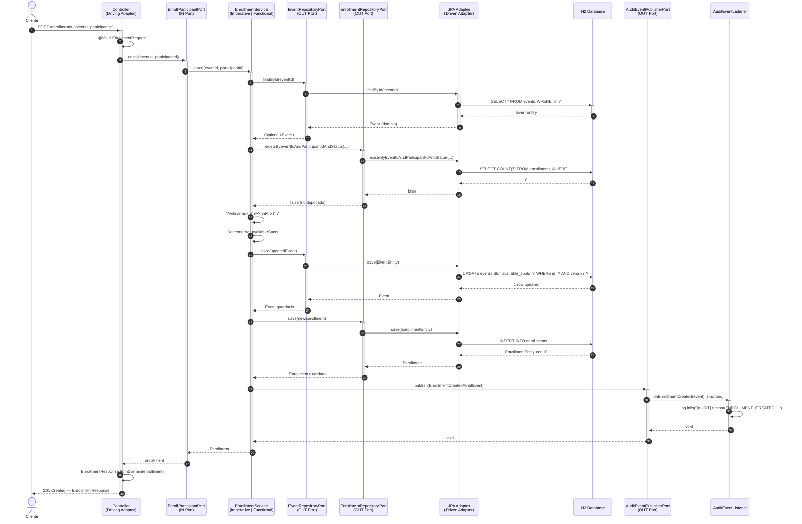
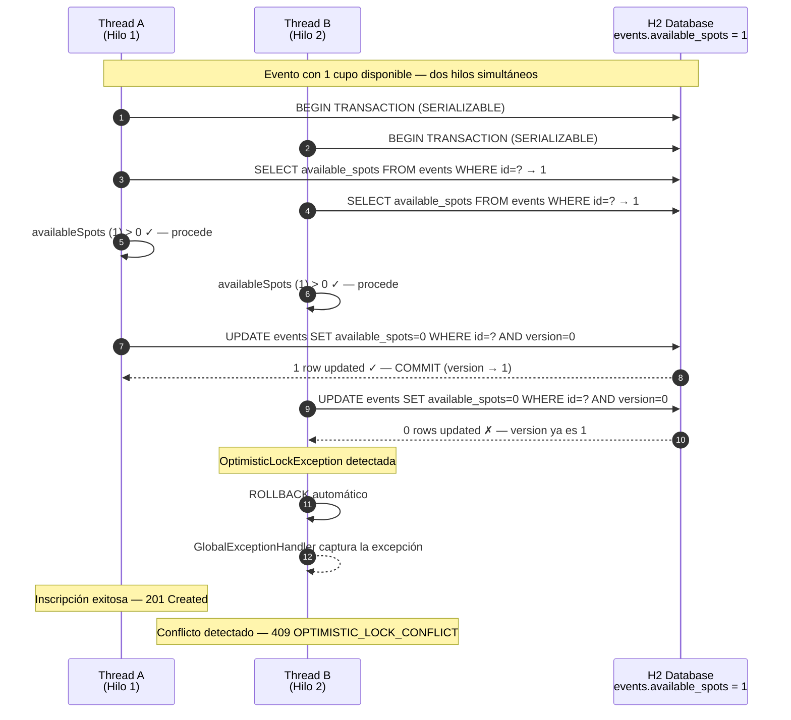

# Sistema de Inscripción a Eventos Universitarios

> **Práctica Entregable — Paradigmas y Drivers Arquitectónicos**
> Aplicación de los paradigmas Imperativo, Orientado a Objetos y Funcional en Java,
> relacionados con Drivers Arquitectónicos que justifican cada decisión estructural.

---

## Tabla de contenido

1. [Descripción del problema](#1-descripción-del-problema)
2. [Drivers Arquitectónicos → Decisiones → Código](#2-drivers-arquitectónicos--decisiones--código)
3. [Arquitectura Hexagonal](#3-arquitectura-hexagonal)
4. [Paradigmas implementados](#4-paradigmas-implementados)
5. [Estructura del proyecto](#5-estructura-del-proyecto)
6. [Diagrama de flujo — Inscripción a evento](#6-diagrama-de-flujo--inscripción-a-evento)
7. [Diagrama de secuencia — Flujo completo por capas](#7-diagrama-de-secuencia--flujo-completo-por-capas)
8. [Diagrama de secuencia — Control de concurrencia](#8-diagrama-de-secuencia--control-de-concurrencia)
9. [API REST](#9-api-rest)
10. [Cómo ejecutar](#10-cómo-ejecutar)
11. [Pruebas](#11-pruebas)
12. [Decisiones excluidas y justificación](#12-decisiones-excluidas-y-justificación)

---

## 1. Descripción del problema

Durante los primeros **10 minutos** de apertura de cupos de un evento universitario
se presentan picos de alta concurrencia: múltiples usuarios intentan inscribirse
al mismo tiempo. Sin control adecuado, dos hilos pueden leer simultáneamente
`availableSpots = 1`, ambos pasar la validación y ambos inscribirse, rompiendo
el límite de capacidad (**sobrecupo**).

El sistema debe garantizar:

- Que nunca se exceda el cupo máximo de un evento.
- Que la auditoría registre cada operación relevante.
- Que sea mantenible y extensible sin tocar la lógica de negocio.
- Que los dos paradigmas de procesamiento (imperativo y funcional) produzcan
  el mismo resultado observable.

---

## 2. Drivers Arquitectónicos → Decisiones → Código

| # | Driver | Decisión                                                                                                                                                                                  | Mecanismo técnico |
|---|--------|-------------------------------------------------------------------------------------------------------------------------------------------------------------------------------------------|-------------------|
| 1 | **Escalabilidad** — picos de carga | Controlar concurrencia en la capa de persistencia. No se usan colas async porque se debe manejar consistencia eventual y basado en los atributos de calidad se requiere consistencia real | `@Transactional(isolation = SERIALIZABLE)` + `@Version` (bloqueo optimista JPA) |
| 2 | **Consistencia de cupos** — no sobrecupo | Bloqueo optimista + validación de idempotencia antes de escribir                                                                                                                          | `@Version Long version` en `EnrollmentEntity`; HTTP 409 en conflicto; `existsByEventIdAndParticipantIdAndStatus` antes de inscribir |
| 3 | **Mantenibilidad / extensibilidad** | Arquitectura Hexagonal: el dominio no sabe nada de Spring, JPA ni HTTP. Cada dependencia externa es un adaptador intercambiable.                                                          | Puertos `in/out` como interfaces; `BeanConfiguration` como punto único de wiring; principios SOLID explícitos |
| 4 | **Observabilidad** — auditoría | Logs estructurados enfocados en eventos de negocio y errores. Spring Events síncronos desacoplan el logging de auditoría del dominio sin complejidad async.                               | `@EventListener` en `AuditEventListener`; `AuditEventPublisherPort` como abstracción; `/actuator/health` y `/actuator/metrics` |

---

## 3. Arquitectura Hexagonal

El proyecto implementa el patrón **Puertos y Adaptadores (Hexagonal Architecture)**:

```
┌─────────────────────────────────────────────────────────────────────┐
│                        DRIVING ADAPTERS                              │
│       REST Controllers  /api/v1/imperative  /api/v1/functional      │
└──────────────────────────────┬──────────────────────────────────────┘
                               │ llama a (puerto IN)
┌──────────────────────────────▼──────────────────────────────────────┐
│                       APPLICATION LAYER                              │
│                                                                      │
│   ImperativeEnrollmentService   │   FunctionalEnrollmentService      │
│   ImperativeCancelService       │   FunctionalCancelService          │
│   ImperativeQuerySpotsService   │   FunctionalQuerySpotsService      │
│   ImperativeListParticipants    │   FunctionalListParticipants       │
│                                                                      │
│  ┌────────────────────────────────────────────────────────────────┐  │
│  │                      DOMAIN LAYER                              │  │
│  │  Event · Participant · Enrollment · EnrollmentStatus           │  │
│  │  Puertos IN  →  EnrollParticipantPort, CancelEnrollmentPort    │  │
│  │                 QueryAvailableSpotsPort, ListEnrolledPort       │  │
│  │  Puertos OUT →  EventRepositoryPort, EnrollmentRepositoryPort  │  │
│  │                 ParticipantRepositoryPort, AuditPublisherPort   │  │
│  │  Excepciones →  EventFullException, DuplicateEnrollment...     │  │
│  └────────────────────────────────────────────────────────────────┘  │
│                               │ usa (puerto OUT)                     │
└──────────────────────────────┬──────────────────────────────────────┘
                               │ implementado por
┌──────────────────────────────▼──────────────────────────────────────┐
│                       DRIVEN ADAPTERS                                │
│   EventJpaAdapter · ParticipantJpaAdapter · EnrollmentJpaAdapter    │
│   SpringAuditEventPublisher → AuditEventListener (@EventListener)   │
│   H2 in-memory (reemplazable por cualquier BD relacional)           │
└─────────────────────────────────────────────────────────────────────┘
```

### Principios SOLID aplicados

| Principio | Aplicación concreta |
|-----------|-------------------|
| **SRP** | Cada servicio implementa exactamente un puerto de entrada. `AuditEventListener` solo escribe logs. `GlobalExceptionHandler` solo mapea errores a HTTP. |
| **OCP** | Agregar un nuevo modo de procesamiento (ej. reactivo) implica crear un nuevo servicio que implemente el puerto existente, sin modificar el dominio. |
| **LSP** | `ImperativeEnrollmentService` y `FunctionalEnrollmentService` son intercambiables como implementaciones de `EnrollParticipantPort`. |
| **ISP** | Un puerto por caso de uso. Los controladores dependen solo del puerto que necesitan. |
| **DIP** | Los servicios dependen de `EventRepositoryPort` (abstracción), nunca de `EventJpaAdapter` (concreción). Spring inyecta vía `@Qualifier`. |

---

## 4. Paradigmas implementados

### Imperativo
Usa estructuras de control explícitas: `if/else`, bucles `for`, variables mutables.

```java
// ImperativeListParticipantsService
List<Participant> participants = new ArrayList<>();
for (Enrollment enrollment : activeEnrollments) {
    Participant p = participantRepository.findById(enrollment.getParticipantId())
            .orElseThrow(() -> new ParticipantNotFoundException(...));
    participants.add(p);
}
return participants;
```

### Funcional / Declarativo
Usa `Optional.orElseThrow`, `Stream`, lambdas y el patrón **Builder** — sin variables mutables en el flujo principal.

```java
// FunctionalListParticipantsService
return enrollmentRepository
        .findByEventIdAndStatus(eventId, EnrollmentStatus.ACTIVE)
        .stream()
        .map(e -> participantRepository.findById(e.getParticipantId())
                .orElseThrow(() -> new ParticipantNotFoundException(...)))
        .toList();
```

### Orientado a Objetos
- **Interfaces** como puertos (`EnrollParticipantPort`, `EventRepositoryPort`).
- **Polimorfismo**: dos implementaciones del mismo puerto, seleccionadas por `@Qualifier`.
- **Herencia de excepciones**: `DomainException` → excepciones concretas.
- **Patrón Builder** en DTOs de respuesta (Lombok `@Builder`).
- **Patrón Repository** en adaptadores JPA.

---

## 5. Estructura del proyecto

```
src/main/java/com/example/
├── InscripcionEventosApplication.java
├── domain/
│   ├── model/                      # Entidades puras (sin deps de framework)
│   │   ├── Event.java
│   │   ├── Participant.java
│   │   ├── Enrollment.java
│   │   └── EnrollmentStatus.java
│   ├── port/
│   │   ├── in/                     # Contratos de casos de uso
│   │   │   ├── EnrollParticipantPort.java
│   │   │   ├── CancelEnrollmentPort.java
│   │   │   ├── QueryAvailableSpotsPort.java
│   │   │   └── ListEnrolledParticipantsPort.java
│   │   └── out/                    # Abstracciones de infraestructura
│   │       ├── EventRepositoryPort.java
│   │       ├── EnrollmentRepositoryPort.java
│   │       ├── ParticipantRepositoryPort.java
│   │       └── AuditEventPublisherPort.java
│   └── exception/                  # Excepciones tipadas con errorCode
├── application/
│   ├── imperative/                 # CU-01..04 con bucles y condicionales
│   └── functional/                 # CU-01..04 con Streams y Optionals
├── infrastructure/
│   ├── persistence/
│   │   ├── entity/                 # Entidades JPA con @Version
│   │   ├── repository/             # Spring Data JPA interfaces
│   │   └── adapter/                # Implementan puertos OUT
│   ├── messaging/
│   │   ├── event/                  # Records de auditoría (inmutables)
│   │   ├── SpringAuditEventPublisher.java
│   │   └── AuditEventListener.java
│   └── web/
│       ├── imperative/             # 4 controladores /api/v1/imperative
│       ├── functional/             # 4 controladores /api/v1/functional
│       ├── dto/                    # Request/Response con @Builder
│       └── handler/                # GlobalExceptionHandler
└── config/
    ├── BeanConfiguration.java      # Wiring puertos ↔ adaptadores
    └── DataInitializer.java        # Loguea UUIDs fijos al arrancar
src/main/resources/
    ├── application.properties
    └── import.sql                  # Seed data con UUIDs fijos (ejecutado por Hibernate)
```

---

## 6. Diagrama de flujo — Inscripción a evento

```mermaid
flowchart TD
    A([Cliente HTTP]) -->|POST /api/v1/{mode}/enrollments| B[Controller]
    B -->|EnrollmentRequest validado| C{¿Evento existe?}

    C -->|No| E1[EventNotFoundException]
    C -->|Sí| D{¿Participante existe?}

    D -->|No| E2[ParticipantNotFoundException]
    D -->|Sí| F{¿Ya inscrito\nACTIVE?}

    F -->|Sí| E3[DuplicateEnrollmentException]
    F -->|No| G{¿availableSpots > 0?}

    G -->|No| E4[EventFullException]
    G -->|Sí| H[Iniciar @Transactional\nSERIALIZABLE]

    H --> I[Decrementar availableSpots]
    I --> J[eventRepository.save]
    J --> K[Crear Enrollment ACTIVE]
    K --> L[enrollmentRepository.save]

    L --> M{¿@Version\nconsistente?}
    M -->|No — conflicto concurrente| E5[OptimisticLockException]
    M -->|Sí| N[Publicar EnrollmentCreatedAuditEvent]
    N --> O[AuditEventListener\nlog INFO]
    O --> P([201 Created\nEnrollmentResponse])

    E1 & E2 & E3 & E4 --> Q[GlobalExceptionHandler]
    E5 --> Q
    Q --> R([4xx/5xx ErrorResponse])

    style H fill:#d4edda,stroke:#28a745
    style M fill:#fff3cd,stroke:#ffc107
    style Q fill:#f8d7da,stroke:#dc3545
    style P fill:#d4edda,stroke:#28a745
    style R fill:#f8d7da,stroke:#dc3545
```

---

## 7. Diagrama de secuencia — Flujo completo por capas



---

## 8. Diagrama de secuencia — Control de concurrencia



---

## 9. API REST

**Base URL:** `http://localhost:8080/api/v1`

Los endpoints se exponen en dos prefijos que seleccionan el paradigma de implementación:

| Método | Path imperativo | Path funcional | Caso de uso | OK | Error |
|--------|----------------|----------------|-------------|-----|-------|
| `POST` | `/imperative/enrollments` | `/functional/enrollments` | Inscribir participante | 201 | 404, 409 |
| `DELETE` | `/imperative/enrollments/{id}` | `/functional/enrollments/{id}` | Cancelar inscripción | 204 | 404 |
| `GET` | `/imperative/events/{id}/spots` | `/functional/events/{id}/spots` | Consultar cupos | 200 | 404 |
| `GET` | `/imperative/events/{id}/participants` | `/functional/events/{id}/participants` | Listar inscritos | 200 | 404 |

### Request — Inscripción

```json
POST /api/v1/imperative/enrollments
Content-Type: application/json

{
  "eventId": "uuid-del-evento",
  "participantId": "uuid-del-participante"
}
```

### Response — Inscripción exitosa

```json
HTTP 201 Created
{
  "enrollmentId": "uuid",
  "eventId": "uuid",
  "participantId": "uuid",
  "enrolledAt": "2026-02-27T10:00:00",
  "status": "ACTIVE"
}
```

### Response — Error

```json
HTTP 409 Conflict
{
  "code": "EVENT_FULL",
  "message": "Event has no available spots: uuid",
  "timestamp": "2026-02-27T10:00:00",
  "path": "/api/v1/imperative/enrollments"
}
```

### Catálogo de errores

| Código | HTTP | Causa |
|--------|------|-------|
| `EVENT_NOT_FOUND` | 404 | El evento no existe |
| `PARTICIPANT_NOT_FOUND` | 404 | El participante no existe |
| `ENROLLMENT_NOT_FOUND` | 404 | La inscripción no existe |
| `EVENT_FULL` | 409 | Sin cupos disponibles |
| `DUPLICATE_ENROLLMENT` | 409 | Participante ya inscrito |
| `OPTIMISTIC_LOCK_CONFLICT` | 409 | Conflicto de concurrencia |
| `VALIDATION_ERROR` | 400 | Datos de entrada inválidos (`@Valid`) |
| `MALFORMED_REQUEST` | 400 | JSON malformado o UUID inválido |

---

## 10. Cómo ejecutar

### Requisitos

- Java 17+
- No se requiere infraestructura externa (H2 corre en memoria)

### Iniciar la aplicación

```bash
./gradlew bootRun
```

Los datos de prueba se insertan mediante `src/main/resources/import.sql`, ejecutado por Hibernate
al crear el schema. Los UUIDs son **fijos** — no cambian entre reinicios:

| Recurso | Nombre | UUID |
|---------|--------|------|
| Evento | Taller de Programación Concurrente | `aaaaaaaa-0001-0001-0001-000000000001` |
| Evento | Charla: Arquitectura Hexagonal (10 cupos) | `aaaaaaaa-0002-0002-0002-000000000002` |
| Participante | Ana García | `bbbbbbbb-0001-0001-0001-000000000001` |
| Participante | Carlos López | `bbbbbbbb-0002-0002-0002-000000000002` |
| Participante | María Torres | `bbbbbbbb-0003-0003-0003-000000000003` |

Al arrancar, el log confirma los IDs activos:

```
INFO  === SEED DATA READY ===
INFO  EVENT   | Taller Concurrente          | id=aaaaaaaa-0001-0001-0001-000000000001
INFO  EVENT   | Charla Hexagonal (10 cupos) | id=aaaaaaaa-0002-0002-0002-000000000002
INFO  PARTICIPANT | Ana García     | id=bbbbbbbb-0001-0001-0001-000000000001
INFO  PARTICIPANT | Carlos López   | id=bbbbbbbb-0002-0002-0002-000000000002
INFO  PARTICIPANT | María Torres   | id=bbbbbbbb-0003-0003-0003-000000000003
INFO  API base: http://localhost:8080/api/v1/{imperative|functional}
```

### Ejemplo rápido con curl

```bash
# 1. Inscribir Ana en la Charla Hexagonal (imperativo)
curl -s -X POST http://localhost:8080/api/v1/imperative/enrollments \
  -H "Content-Type: application/json" \
  -d '{"eventId":"aaaaaaaa-0002-0002-0002-000000000002","participantId":"bbbbbbbb-0001-0001-0001-000000000001"}' | jq .

# 2. Consultar cupos disponibles (funcional)
curl -s http://localhost:8080/api/v1/functional/events/aaaaaaaa-0002-0002-0002-000000000002/spots | jq .

# 3. Listar inscritos (funcional)
curl -s http://localhost:8080/api/v1/functional/events/aaaaaaaa-0002-0002-0002-000000000002/participants | jq .

# 4. Cancelar inscripción (imperativo) — usar el enrollmentId devuelto en el paso 1
curl -s -X DELETE http://localhost:8080/api/v1/imperative/enrollments/<ENROLLMENT_ID>
```

### Consola H2

Disponible en `http://localhost:8080/h2-console`

| Campo | Valor |
|-------|-------|
| JDBC URL | `jdbc:h2:mem:inscripciones` |
| User | `sa` |
| Password | *(vacío)* |

### Actuator

```bash
curl http://localhost:8080/actuator/health   # Estado de la app y H2
curl http://localhost:8080/actuator/metrics  # Métricas JVM y endpoints
```

---

## 11. Pruebas

```bash
# Ejecutar todos los tests
./gradlew test

# Ver reporte HTML
open build/reports/tests/test/index.html
```

### Cobertura de tests — 31 en total

| Suite | Tests | Tipo |
|-------|-------|------|
| `ImperativeEnrollmentServiceTest` | 6 | Unitario — Mockito |
| `ImperativeCancelEnrollmentServiceTest` | 3 | Unitario — Mockito |
| `ImperativeQuerySpotsServiceTest` | 2 | Unitario — Mockito |
| `ImperativeListParticipantsServiceTest` | 3 | Unitario — Mockito |
| `FunctionalEnrollmentServiceTest` | 4 | Unitario — Mockito |
| `FunctionalListParticipantsServiceTest` | 2 | Unitario — Mockito |
| `GlobalExceptionHandlerTest` | 6 | Unitario — MockMvc standaloneSetup |
| `EnrollmentJpaAdapterTest` | 4 | Integración — `@DataJpaTest` + H2 |

Todos los métodos de test siguen el patrón **Given / When / Then** en el nombre y cuerpo del método.

---

## 12. Decisiones excluidas y justificación

| Decisión excluida | Justificación |
|-------------------|--------------|
| **Spring Events `@Async` + ThreadPool** | Las colas asíncronas hacen el resultado de inscripción **eventual**, contradiciendo el driver de consistencia inmediata (CU-01). El bloqueo optimista resuelve el problema real sin complejidad adicional. |
| **Redis / RabbitMQ / Kafka** | Infraestructura externa. La POC corre sin dependencias externas gracias a H2 y Spring Events síncronos. |
| **Colas simuladas con ConcurrentHashMap** | La idempotencia + `@Version` JPA resuelven la consistencia de forma estándar y testeable, sin estructuras de datos paralelas adicionales. |

---

## Stack tecnológico

| Componente | Tecnología |
|-----------|-----------|
| Lenguaje | Java 17 |
| Framework | Spring Boot 3.4.3 |
| Build | Gradle 9.0.0 |
| Persistencia | Spring Data JPA + H2 (in-memory) |
| Observabilidad | SLF4J + Logback · Spring Boot Actuator |
| Reducción de boilerplate | Lombok (`@Builder`, `@RequiredArgsConstructor`) |
| Testing | JUnit 5 · Mockito · MockMvc · `@DataJpaTest` |
| Mensajería | Spring Application Events (síncronos) |
